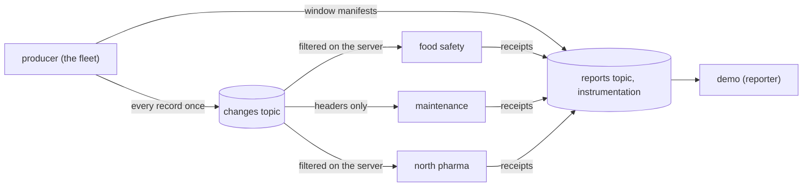

# Frostline

**Publish every change once. Let each consumer receive only the records it needs.**

Frostline demonstrates **server-side consumer filtering for change data capture (CDC)** with the [Laser SDK](https://github.com/laserdata/laser-sdk) over [Apache Iggy](https://iggy.apache.org). Eight hundred simulated refrigerated trucks share one topic. Food safety, maintenance, and regional operations each consume a different slice. The server selects records before sending them to each consumer.

In the historical ten-million-record run, **four filtered readers moved 1.11 GB instead of 31.40 GB, saving 96.5% of TCP application traffic**. These are measured results for this workload. The [comparison below](#measured-bandwidth-savings) includes server CPU costs and links to latency measurements.

- **Filter before transfer.** Each group receives its matches without downloading the full feed to discard records locally.
- **React to changes.** Food safety selects transitions into an unsafe temperature band, using both old and new values.
- **Skip payload decoding with header filters.** Maintenance selects faults through typed headers. Other filters read payload fields.
- **Compare filter revisions.** Two food-safety groups own different policies and measure the extra traffic.
- **Measure the tradeoff.** Compare filtered and ordinary readers for matching records, transferred bytes, CPU, memory, and p50/p99/p99.9 latency.

Run the finite demo, keep the fleet running with `just demo`, or try **JSON, CBOR, Avro, and Protobuf** with `just codecs`.

## Run locally

Clone [Laser Stack](https://github.com/laserdata/laser-stack) beside this checkout before running `just up`. To run against locally built Iggy and plane binaries instead, use the local runtime described in [operations](docs/operations.md).

```sh
just up          # start Laser Stack and wait until it is healthy
just demo-once   # the finite story: publish, read, report, clean up
just down        # stop Laser Stack and keep its data
```

`just up-local` runs the same stories on your own build of the LaserData Iggy server, see [operations](docs/operations.md). The same binaries talk to LaserData Cloud when you change the connection string:

```sh
LASER_CONNECTION_STRING=user:pwd@your-host.laserdata.cloud?nodelay=true just demo-once
```

## What each team receives

| team | records it needs | filter behavior |
| --- | --- | --- |
| Food safety | Trucks that just turned unsafe | Requires a changed temperature band, an old value that was not unsafe, and a new unsafe value |
| Maintenance | Reefer faults | Reads typed headers without decoding the payload |
| Regional operations | Northern pharma and frozen-load telemetry, plus changes for loads of at least 10 tonnes | Combines event type, region, cargo, and a numeric comparison of decimal-string weights |

The producer publishes every record once. Each reader handles its matches and publishes a receipt at each checkpoint. **Reports count only windows that every reader finished**, so a slow reader never looks like savings.

## Measured bandwidth savings

The historical reference workload contains **ten million JSON change records and 6.30 GB of source payload**. Four consumer groups each read it once with a filter and once through an ordinary reader that downloads everything.

| group | matched records | payload MB | payload avoided | TCP receive MB | TCP receive avoided |
| --- | ---: | ---: | ---: | ---: | ---: |
| food-safety | 19,394 | 13.07 | **99.8%** | 28.54 | **99.6%** |
| food-safety-current | 302,536 | 201.88 | **96.8%** | 280.78 | **96.4%** |
| maintenance | 92,509 | 48.73 | **99.2%** | 86.11 | **98.9%** |
| north-pharma | 834,808 | 513.97 | **91.8%** | 676.54 | **91.4%** |
| all four groups | | 777.64 | **96.9%** | 1071.96 | **96.6%** |

**Including both directions, the four readers moved 1.11 GB instead of 31.40 GB, a 96.5% reduction in TCP application traffic.**

These historical measurements compared revisions of one saved filter. The current demo gives each group its own policy. `food-safety-current` also accepts updates from trucks that are already unsafe. **A looser filter delivers more records and uses more bandwidth.**

Filtering shifts work to the server. The same run measured these costs:

| measurement | filtered readers | ordinary readers |
| --- | ---: | ---: |
| Reader CPU | **5.91 s** | 66.78 s |
| Iggy CPU | 99.50 s | 31.32 s |
| Combined Iggy, plane, and reader CPU | 107.46 s | 98.15 s |
| Read-phase duration | 29.97 s | 23.38 s |

**Traffic savings do not imply lower latency or lower total CPU.** Combined CPU rose by about 9.5% in this run. [Benchmarks](docs/benchmarks.md) lists p50/p99/p99.9 latency, sample counts, memory, and codec costs.

The results are stored in [measurements/fleet_10m](measurements/fleet_10m), with component versions and catalog-version confirmation. TCP counts come from reader syscalls recorded with `strace`. They exclude TCP/IP headers and retransmissions. Repeat the workload:

```sh
cargo build --release --workspace
scripts/replay-trial fleet_10m --nodelay --out runs/repeat-10m
```

For a smaller comparison, run `just compare`. It adds ordinary readers that download the whole feed and filter in the application. **Both paths must select the same records, or the run fails.**

## One log, many kinds of events

The finite story ends with a `mixed` topic: a fleet reading in JSON, a depot event in CBOR, an invoice in Protobuf, a reading whose region is a number instead of text, and a depot event in JSON, all in one partition with an `event.type` header. Four filters preview it:

```text
Filter north-pharma over the mixed log selected [0] and skipped [1, 2, 3, 4].
Filter north-pharma with mismatch pass over the mixed log selected [0] and skipped [1, 2, 4], and handed over unevaluated [3 (type_mismatch)].
Filter depot v1 by glob over the mixed log selected [1, 4] and skipped [0, 2, 3].
Filter every v1 event ignoring case over the mixed log selected [0, 1, 3, 4] and skipped [2].
```

The JSON filter never decodes the CBOR and Protobuf records, and it never stalls on them. A record with a field of the wrong type is skipped by default. When the filter asks for edge cases, that record is handed to the consumer marked unevaluated instead. Header text matching by prefix, suffix, contains, glob, or regex picks a subdomain across every codec. A headers-only filter avoids payload decoding. Complete reader-call costs are measured separately from evaluator microbenchmarks. [Filters](docs/filters.md) has the details.

## Read it like a book

| time | path | question answered |
| --- | --- | --- |
| 5 minutes | run `just demo-once`, then read the [architecture](docs/architecture.md) | What crosses each boundary? |
| 15 minutes | follow the [walkthrough](docs/walkthrough.md) | What does each line of the demo mean, and where is its code? |
| 10 minutes | read the [filters](docs/filters.md) | How is each team's filter built, and why? |
| reference | [measurement](docs/measurement.md), [operations](docs/operations.md), [benchmarks](docs/benchmarks.md), [SDK map](docs/sdk-map.md) | How is savings counted, how do I run it, and where is each SDK call? |

Read the [SDK consumer-filter tutorial](https://github.com/laserdata/laser-sdk/blob/main/docs/tutorial.md#chapter-11---read-only-the-records-you-need) and the [AGDX consumer-filter contract](https://github.com/laserdata/laser-sdk/blob/main/docs/agdx.md#a14-consumer-filters). The [Laser SDK repository](https://github.com/laserdata/laser-sdk) holds the focused `cdc` example in Rust, Python, and TypeScript, and [Photon Market](https://github.com/laserdata/laser-example-photon-market) shows the same SDK composing a multi-service system.

## Architecture



| crate | role |
| --- | --- |
| [`shared`](crates/shared/README.md) | Domain, the event on the wire, the three policies, codecs, measurement, settings, connection, lifecycle |
| [`producer`](crates/producer/README.md) | The seeded fleet, ordered per-partition publishing, checkpoints, window manifests |
| [`consumers`](crates/consumers/README.md) | One reader per team, the full-feed baseline, receipts |
| [`demo`](crates/demo/README.md) | The composition root: doctor, provisioning, the stories, the board, the report, cleanup |
| [`bench`](crates/bench/README.md) | Datasets, trials, collectors, and profiler wrappers for benchmark evidence |

## Commands

| command | does |
| --- | --- |
| `just demo-once` | the finite story |
| `just compare` | the finite story plus full-feed readers |
| `just demo` | the fleet until Ctrl+C, with a live board |
| `just codecs` | the finite story in JSON, CBOR, Avro, and Protobuf |
| `just inline` | the finite story with group policies and no revision walkthrough |
| `just doctor` | checks filters, the catalog, and codecs |
| `just bench <profile>` | one benchmark profile, see [benchmarks](docs/benchmarks.md) |
| `just ci` | formatting, dependencies, clippy, unit, integration, and end to end tests |

Settings are `FROSTLINE_*` environment variables. The full table is in [operations](docs/operations.md).

Connection variables mirror the Laser SDK examples: `LASER_CONNECTION_STRING`, or `LASER_SERVER` with `LASER_TOKEN` / `LASER_USERNAME` + `LASER_PASSWORD`, plus `LASER_NO_TLS`. The local default is `iggy:laser@127.0.0.1:8090`.

## Testing

```sh
just test      # unit
just test-it   # focused LaserData Iggy fork integration
just e2e       # the full stories
just ci        # the whole gate
```

The strongest proof in the suite is `given_the_same_settings_when_run_twice_then_should_repeat_every_count_and_byte`. It runs the whole finite story twice and checks that every match count and every byte figure comes out the same.

## Filtering cost and latency

**Measure the savings and the cost together.** The three-repetition million-record JSON run in `measurements/fleet_1m` used 8.60 seconds of Iggy CPU with filters and 3.02 seconds for ordinary reads. Filtered median round latency ranged from 0.59 to 2.18 ms, against 0.40 to 0.42 ms for ordinary polls. A filtered round can visit several partitions and store progress for empty pages.

[Benchmarks](docs/benchmarks.md#client-latency) states what to expect from filtering in latency, CPU, and traffic, with every role's p50, p99, and p99.9. [Benchmark commands](crates/bench/README.md#matched-replay-and-streaming-measurements) save phase CPU, RSS/PSS, latency, and optional flamegraphs. Repeat them on your deployment before using local figures for capacity planning.

## Limits

Payload figures count record payloads. The wire table counts received TCP application bytes. Sent control traffic is recorded separately. TCP/IP headers and retransmissions are excluded. Payload and socket figures differ because of framing, headers, acknowledgments, checkpoints, and receipts. TLS was off in the local runs. Every consumer group makes the server examine the whole log once, so server CPU grows with groups times records. The simulator is a CDC producer, not a database connector. Receipts are at least once, and the report treats a repeat as a duplicate, not as extra savings.

`laser-sdk` resolves from crates.io. Native integration runs on a prepared self-hosted Linux runner when `FROSTLINE_INTEGRATION=true`, with explicit `FROSTLINE_IGGY_SERVER` and `FROSTLINE_PLANE` paths, and only where the supplied Iggy server and plane serve consumer filters. Local `just ci` runs the complete native gate.

## Layout

New to the codebase? Follow the finite story end to end in [docs/walkthrough.md](docs/walkthrough.md), from the producer's first window to the report that counts the savings.

See [AGENTS.md](AGENTS.md) for the crate tree and conventions, and [docs/architecture.md](docs/architecture.md) for what crosses each boundary.

## License

Apache License 2.0. See [LICENSE](LICENSE) and [NOTICE](NOTICE).
